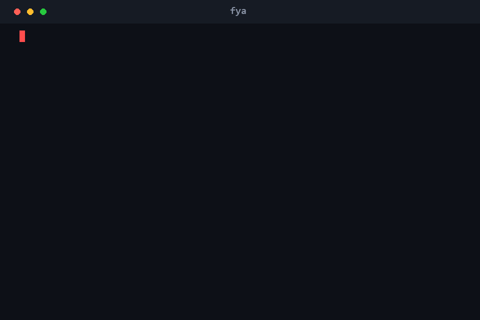

<div align="center">

# F\*ck Your App

### `fya`

**Point it at your app. It tries to break it.**

A dynamic, target-adaptive security scanner for localhost servers and Android APKs.

[](https://github.com/ayam04/fya/actions/workflows/ci.yml)
[](https://pypi.org/project/fya/)
[](https://www.python.org/)
[](LICENSE)
[](https://github.com/astral-sh/ruff)
[](CONTRIBUTING.md)

<br/>



</div>

> [!WARNING]
> **Authorized testing only.** Only scan systems you own or are explicitly
> authorized in writing to test. Scanning a target that is not local requires
> the `--i-am-authorized` flag. Unauthorized scanning may be illegal. You are
> responsible for how you use this tool. See [SECURITY.md](SECURITY.md).

## Table of Contents

- [What it is](#what-it-is)
- [Highlights](#highlights)
- [Install](#install)
- [Quickstart](#quickstart)
- [Scan profiles](#scan-profiles)
- [What it checks](#what-it-checks)
- [How it adapts per target](#how-it-adapts-per-target)
- [External tools](#external-tools)
- [Reports](#reports)
- [Architecture](#architecture)
- [Contributing](#contributing)
- [Acknowledgements](#acknowledgements)
- [License](#license)

## What it is

`fya` is an open-source, dynamic security scanner. Give it a running server
(localhost or a URL) or an Android `.apk`, and it detects what the target is,
fingerprints it, tunes its own scan parameters to fit, and runs a battery of
security checks mapped to the OWASP Top 10 and OWASP MASVS. It ships its own
fast, pure-Python checks and, when they are installed, orchestrates the
best-in-class tools (Nuclei, Nikto, sqlmap, nmap, testssl, jadx, apkleaks)
instead of reinventing them.

## Highlights

- **One tool, two targets.** Scan a running web server or an Android `.apk` with the same command.
- **Adaptive.** Detects the stack, tunes payloads and request pacing, and runs only the checks that apply.
- **You pick the mode.** Choose `recon`, `web`, `api`, `mobile`, or `full` (or an interactive menu), and watch a live per-category progress animation as it runs.
- **29 checks, OWASP-mapped.** Web, API, TLS, and APK static analysis, each tagged to OWASP Top 10 / MASVS and CWE.
- **Orchestrates, does not reinvent.** Uses Nuclei, Nikto, sqlmap, nmap, and testssl when present; falls back to built-in checks when not.
- **Safe by default.** Non-destructive, no flooding, request pacing that backs off on errors, localhost allowed, remote requires explicit authorization.
- **CI-ready reports.** Console, JSON, SARIF, Markdown, and self-contained HTML, with `--fail-on` exit codes.
- **Tiny core.** `requests` and `rich` only. APK analysis, a browser, and external tools are optional.

## Install

```bash
pip install fya                 # from PyPI
pip install "fya[apk]"          # add Android APK manifest analysis (androguard)
```

From a clone, with test tooling:

```bash
git clone https://github.com/ayam04/fya
cd fya
pip install -e ".[dev]"
```

Python 3.9 or newer.

## Quickstart

```bash
# scan a local dev server (no authorization flag needed for localhost)
fya scan http://127.0.0.1:8000

# read-only, then progressively heavier
fya scan http://127.0.0.1:8000 --profile passive
fya scan http://127.0.0.1:8000 --profile safe          # default
fya scan http://127.0.0.1:8000 --profile aggressive

# pick what to run, or choose from a menu
fya scan http://127.0.0.1:8000 --mode web              # web + tls + api
fya scan http://127.0.0.1:8000 --mode full             # everything, aggressive
fya scan http://127.0.0.1:8000 --interactive           # menu to pick mode + profile
fya modes                                               # list the modes

# analyze an Android app
fya scan ./app-release.apk

# write a shareable report (format inferred from the extension)
fya scan http://127.0.0.1:8000 -o report.html
fya scan http://127.0.0.1:8000 -o findings.sarif       # for CI code scanning

# fail a CI job if anything high or worse is found
fya scan http://127.0.0.1:8000 --fail-on high

# a non-local target requires explicit authorization
fya scan https://staging.example.com --i-am-authorized

# see which external tools fya can hand off to
fya tools
```

Try it right now against the bundled deliberately-vulnerable app:

```bash
python examples/vulnerable_app.py       # starts on http://127.0.0.1:5001
fya scan http://127.0.0.1:5001 --profile aggressive -o report.html
```

## Scan profiles

| Profile      | What it does                                                       |
|--------------|--------------------------------------------------------------------|
| `passive`    | Read-only. Headers, TLS, cookies, disclosure, fingerprinting.      |
| `safe`       | Non-destructive active probes. Reflection, error signatures, CORS. |
| `aggressive` | Heavier probing and external-tool handoff. Still non-destructive.  |

`fya` never floods a target or runs denial-of-service payloads. Request pacing
adapts automatically, slowing down on errors, timeouts, and slow responses.

## What it checks

29 checks across the areas below, each mapped to OWASP Top 10 / MASVS and a CWE.
Full catalog in [docs/checks.md](docs/checks.md).

| Area           | Checks |
|----------------|--------|
| Web (passive)  | Security headers, server/version disclosure, insecure cookie flags |
| Web (active)   | Reflected XSS, error-based SQLi, open redirect, path traversal, CORS misconfiguration, dangerous HTTP methods, sensitive file exposure |
| Web (advanced) | Server-side template injection (SSTI), missing CSRF token, Host header injection, CRLF/header injection |
| TLS           | Certificate validity and trust, weak protocol versions, missing HTTP to HTTPS upgrade |
| API           | OpenAPI/Swagger exposure, GraphQL introspection, verbose error disclosure, unauthenticated admin/debug endpoints |
| APK (static)  | Hardcoded secrets, cleartext HTTP endpoints, manifest issues (debuggable, backup, exported components, cleartext, minSdk, permissions) |
| Integrations  | Nuclei, Nikto, nmap, sqlmap, testssl/sslyze handoff, normalized into the same report |

<div align="center">


</div>

## How it adapts per target

1. **Detect** whether the target is a web server or an `.apk`.
2. **Fingerprint** the tech stack (server, framework, cookies, whether it is a JSON API) from the first responses.
3. **Select** only the checks that apply to that target kind and profile.
4. **Tune** payloads, pacing, and concurrency to what the target tolerates.
5. **Normalize** every finding to OWASP / CWE and de-duplicate.
6. **Report** to console, JSON, SARIF, Markdown, or a self-contained HTML page.

## External tools

If any of these are on your `PATH`, `fya` uses them and folds their results
into one normalized report. If not, it silently falls back to built-in checks.

`nuclei` · `nikto` · `sqlmap` · `nmap` · `testssl.sh` · `sslyze` · `jadx` · `apkleaks`

Check what is detected with `fya tools`.

## Reports

| Format     | Use it for |
|------------|------------|
| `console`  | The default. A colored summary table in your terminal. |
| `json`     | Machine-readable output for pipelines and dashboards. |
| `sarif`    | Upload to GitHub code scanning and other SARIF consumers. |
| `markdown` | Drop into issues, wikis, or pull requests. |
| `html`     | A self-contained, shareable page. See [docs/sample-report.html](docs/sample-report.html). |

Format is inferred from the `-o` file extension, or set it explicitly with
`--format`. Use `--fail-on {low,medium,high,critical}` to return a non-zero
exit code in CI.

## Architecture

```
fya/
  models.py        finding, target, profile, scan-result data models
  detect.py        target-kind detection (web vs apk)
  fingerprint.py   web tech fingerprinting used to tune checks
  http.py          adaptive, self-throttling HTTP client
  registry.py      the Check base class and auto-discovery
  engine.py        orchestrator: fingerprint, plan, run in parallel, collect
  authorization.py the scope and consent gate
  tools.py         detection and safe subprocess handoff to external tools
  report.py        console / json / sarif / markdown / html reporters
  checks/          one file per area, auto-registered on import
```

Details in [docs/architecture.md](docs/architecture.md).

## Contributing

Issues and PRs welcome. Adding a check is a single file dropped in
`fya/checks/`, auto-discovered on import. Run `pytest` and `ruff check .`
before submitting. See [CONTRIBUTING.md](CONTRIBUTING.md) for the walkthrough.

## Acknowledgements

Built on the shoulders of [OWASP](https://owasp.org/) (Top 10 and MASVS/MASTG),
the tools it orchestrates ([Nuclei](https://github.com/projectdiscovery/nuclei),
[Nikto](https://github.com/sullo/nikto), [sqlmap](https://sqlmap.org/),
[Nmap](https://nmap.org/), [testssl.sh](https://testssl.sh/),
[androguard](https://github.com/androguard/androguard)), and
[requests](https://requests.readthedocs.io/) + [rich](https://github.com/Textualize/rich).

## License

[MIT](LICENSE).
