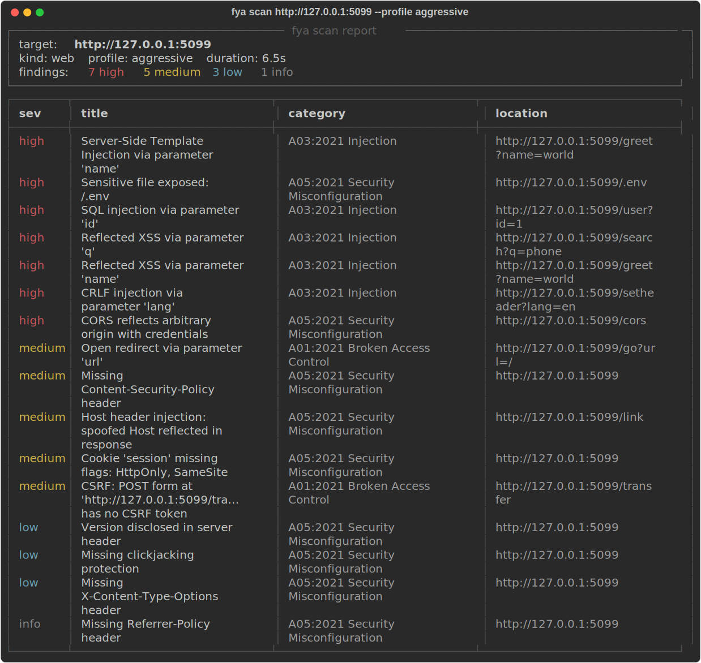
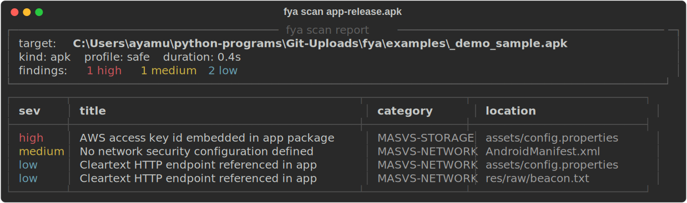

<div align="center">

# F\*ck Your App

### `fya`

**Point it at your app. It tries to break it.**

[](https://github.com/ayam04/fya/actions/workflows/ci.yml)
[](https://pypi.org/project/fya/)
[](https://www.python.org/)
[](LICENSE)
[](https://github.com/astral-sh/ruff)
[](CONTRIBUTING.md)

</div>

`fya` is an open-source, dynamic security scanner. Give it a running server
(localhost or a URL) or an Android `.apk`, and it detects what the target is,
fingerprints it, tunes its own scan parameters to fit, and runs a battery of
security checks mapped to the OWASP Top 10 and OWASP MASVS. It ships its own
fast, pure-Python checks and, when they are installed, orchestrates the
best-in-class tools (Nuclei, Nikto, sqlmap, nmap, testssl, MobSF, jadx,
apkleaks) instead of reinventing them.

> **Authorized testing only.** Only scan systems you own or are explicitly
> authorized in writing to test. Scanning targets that are not local requires
> the `--i-am-authorized` flag. Unauthorized scanning may be illegal. You are
> responsible for how you use this tool.

## Highlights

- **One tool, two targets.** Scan a running web server or an Android `.apk` with the same command.
- **Adaptive.** Detects the stack, tunes payloads and request pacing, and runs only the checks that apply.
- **25 checks, OWASP-mapped.** Web, API, TLS, and APK static analysis, each tagged to OWASP Top 10 / MASVS and CWE.
- **Orchestrates, does not reinvent.** Uses Nuclei, Nikto, sqlmap, nmap, and testssl when present; falls back to built-in checks when not.
- **Safe by default.** Non-destructive, no flooding, localhost allowed, remote requires explicit authorization.
- **CI-ready reports.** Console, JSON, SARIF, Markdown, and self-contained HTML, with `--fail-on` exit codes.

## Demo

`fya` breaking the bundled vulnerable app in one run: reflected XSS,
error-based SQLi, CORS reflecting an arbitrary origin with credentials, an
open redirect, and an exposed `.env`.



Static analysis of an Android APK, finding a hardcoded AWS key and cleartext
endpoints:



Regenerate these locally with `python examples/demo.py`. A full HTML report is
saved to [`docs/sample-report.html`](docs/sample-report.html).

## Install

```bash
pip install -e ".[dev]"          # from a clone, with test tooling
pip install fya                   # once published
pip install "fya[apk]"            # add Android APK static analysis
```

Python 3.9+. Core dependencies are just `requests` and `rich`; everything
heavier is an optional extra or an external tool detected at runtime.

## Quickstart

```bash
# scan a local dev server (no authorization flag needed for localhost)
fya scan http://127.0.0.1:5000

# read-only, then progressively heavier
fya scan http://127.0.0.1:5000 --profile passive
fya scan http://127.0.0.1:5000 --profile safe        # default
fya scan http://127.0.0.1:5000 --profile aggressive

# analyze an Android app
fya scan ./app-release.apk

# write a shareable report; format is inferred from the extension
fya scan http://127.0.0.1:5000 -o report.html
fya scan http://127.0.0.1:5000 -o findings.sarif     # for CI code scanning
fya scan http://127.0.0.1:5000 -o report.json

# fail a CI job if anything high or worse is found
fya scan http://127.0.0.1:5000 --fail-on high

# a non-local target requires explicit authorization
fya scan https://staging.example.com --i-am-authorized

# see which external tools fya can hand off to
fya tools
```

## Try it against the bundled vulnerable app

```bash
python examples/vulnerable_app.py          # starts on http://127.0.0.1:5001
fya scan http://127.0.0.1:5001 -o report.html
```

## Profiles

| Profile      | What it does                                                       |
|--------------|--------------------------------------------------------------------|
| `passive`    | Read-only. Headers, TLS, cookies, disclosure, fingerprinting.      |
| `safe`       | Non-destructive active probes. Reflection, error signatures, CORS. |
| `aggressive` | Heavier probing and external-tool handoff. Still non-destructive.  |

`fya` never floods a target or runs denial-of-service payloads. Request pacing
adapts automatically: it slows down on errors, timeouts, and slow responses.

## How it adapts per target

1. **Detect** whether the target is a web server or an `.apk`.
2. **Fingerprint** the tech stack (server, framework, cookies, whether it is a
   JSON API) from the first responses.
3. **Select** only the checks that apply to that target kind and profile.
4. **Tune** payloads, pacing, and concurrency to what the target tolerates.
5. **Normalize** every finding to OWASP / CWE and de-duplicate.
6. **Report** to console, JSON, SARIF, Markdown, or a self-contained HTML page.

## Architecture

```
fya/
  models.py        finding, target, profile, scan-result data models
  detect.py        target-kind detection (web vs apk)
  fingerprint.py   web tech fingerprinting used to tune checks
  http.py          adaptive, self-throttling HTTP client
  registry.py      the Check base class and auto-discovery
  engine.py        orchestrator: fingerprint, plan, run in parallel, collect
  authorization.py the scope and consent gate
  tools.py         detection and safe subprocess handoff to external tools
  report.py        console / json / sarif / markdown / html reporters
  checks/          one file per area, auto-registered on import
```

Adding a check is one file dropped in `fya/checks/`:

```python
from ..models import Finding, Severity, TargetKind
from ..registry import Check, register

@register
class MyCheck(Check):
    name = "web.my_check"
    target_kinds = (TargetKind.WEB,)
    def run(self, ctx):
        r = ctx.http.get(ctx.target.base_url())
        if r is not None and "X-My-Header" not in r.headers:
            yield Finding(check=self.name, title="...", severity=Severity.LOW,
                          description="...", target=ctx.target.label())
```

It is discovered automatically. No central registration list to edit.

## External tools (optional)

If these are on your `PATH`, `fya` will use them and fold their results into a
single normalized report; if not, it silently falls back to built-in checks.

`nuclei`, `nikto`, `sqlmap`, `nmap`, `testssl.sh`, `sslyze`, `jadx`, `apkleaks`.

## Contributing

Issues and PRs welcome. Run `pytest` and `ruff check .` before submitting. New
checks should be small, mapped to OWASP/CWE, and non-destructive by default.

## License

MIT. See [LICENSE](LICENSE).
